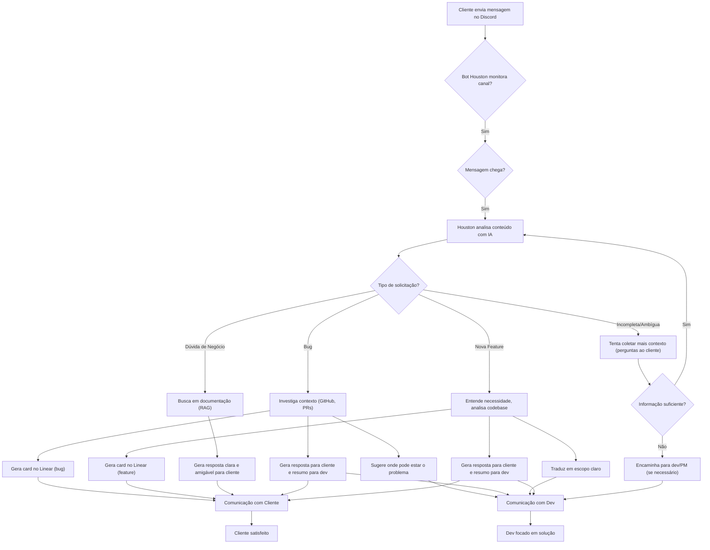

# Documento de Produto: Houston

## 1. Visão Geral do Produto

**Houston** é um sistema inteligente projetado para atuar como uma camada de orquestração e automação entre clientes e equipes de desenvolvimento. Seu objetivo principal é otimizar a comunicação, a triagem e o encaminhamento de demandas, utilizando inteligência artificial para entender, processar e agir sobre as solicitações dos clientes de forma autônoma e eficiente.

## 2. Problema que Estamos Resolvendo

A comunicação entre clientes e equipes de desenvolvimento frequentemente sofre de ineficiências, levando a:

*   **Demora na Resposta:** Clientes esperam por respostas, enquanto desenvolvedores estão ocupados com tarefas de codificação, resultando em atrasos na triagem e resolução de problemas.
*   **Falta de Contexto:** Demandas chegam com informações incompletas ou ambíguas, exigindo múltiplos ciclos de perguntas e respostas para o entendimento, o que consome tempo de ambos os lados.
*   **Sobrecarga da Equipe de Desenvolvimento:** Desenvolvedores são frequentemente interrompidos para triar e responder a solicitações que poderiam ser automatizadas ou resolvidas com informações existentes.
*   **Comunicação Ineficaz:** A linguagem técnica dos desenvolvedores pode não ser compreendida pelos clientes, e vice-versa, gerando frustração e desalinhamento.
*   **Processos Manuais Repetitivos:** A criação de cards em sistemas de gestão de projetos (ex: Linear) e a busca por informações em bases de conhecimento são tarefas manuais que consomem tempo valioso.

## 3. Proposta de Valor

**Houston** oferece uma proposta de valor clara para clientes e equipes de desenvolvimento:

*   **Para Clientes:** Respostas mais precisas, comunicação clara e amigável, e a sensação de que suas demandas são compreendidas e tratadas com agilidade, mesmo fora do horário comercial.
*   **Para Desenvolvedores:** Redução da carga de trabalho de triagem e comunicação inicial, recebimento de demandas já pré-analisadas e contextualizadas, permitindo que se concentrem em tarefas de maior valor (codificação e resolução de problemas complexos).
*   **Para a Empresa:** Aumento da satisfação do cliente, otimização dos recursos da equipe de desenvolvimento, aceleração do ciclo de feedback e melhoria contínua do produto através de um fluxo de comunicação mais eficiente.

## 4. Personas Envolvidas

Para o sistema Houston, identificamos as seguintes personas:

*   **Cliente (Usuário Final):** Indivíduo ou empresa que utiliza/possui o produto e que envia suas demandas (bugs, dúvidas, sugestões) através de canais de comunicação como o Discord. Espera agilidade, clareza e resoluções eficazes.
*   **Desenvolvedor (Dev):** Membro da equipe de engenharia responsável por implementar novas funcionalidades, corrigir bugs e manter o sistema. Busca reduzir interrupções, receber informações contextualizadas e focar em tarefas técnicas.
*   **Product Manager (PM):** Responsável pela visão do produto, priorização de funcionalidades e alinhamento com as necessidades do negócio e do cliente. Beneficia-se de um fluxo de feedback mais estruturado e da automação da triagem de demandas.
*   **Time de Suporte/Atendimento:** Equipe que interage diretamente com os clientes. Pode usar o Houston como uma ferramenta para escalar problemas complexos e fornecer respostas rápidas para dúvidas comuns.

## 5. Principais Casos de Uso

O Houston será fundamental para os seguintes casos de uso:

### 5.1. Triagem e Resolução de Bugs

1.  **Cliente reporta um bug:** O cliente envia uma mensagem no Discord descrevendo um problema.
2.  **Houston analisa e contextualiza:** O sistema utiliza IA (anthropic) para identificar que é um bug, extrai informações relevantes (ex: qual funcionalidade, passos para reproduzir) e busca contexto adicional (ex: histórico de PRs no GitHub, Codebase no github, logs).
3.  **Houston gera card e notifica dev:** Um card detalhado é criado automaticamente no Linear com todas as informações coletadas e sugestões de onde o problema pode estar. Um resumo é enviado ao desenvolvedor em um canal privado.
4.  **Houston sugere resposta ao cliente:** Uma sugestão de resposta clara, humana e amigável (para o cliente) é enviada ao dev junto ao resumo. Por exemplo: confirmando o recebimento, explicando o bug em alto nível, informando que o problema está sendo tratado e, se possível, oferecendo uma solução temporária ou um prazo estimado. O Houston não responde o cliente diretamente.

### 5.2. Resposta a Dúvidas de Negócio

1.  **Cliente pergunta sobre negócio:** O cliente tem uma dúvida sobre uma política, regra de negócio ou funcionalidade específica. Ou o cliente achou que era um bug, mas era uma regra de negócio/política.
2.  **Houston busca em base de conhecimento:** O sistema utiliza RAG (Retrieval Augmented Generation) para buscar a resposta em documentação interna.
3.  **Houston sugere resposta ao cliente:** Uma sugestão de resposta direta, precisa e amigável é fornecida ao dev junto ao resumo, citando a fonte, se aplicável. O Houston não responde o cliente diretamente.

### 5.3. Coleta e Escopo de Novas Features

1.  **Cliente sugere uma feature:** O cliente descreve uma necessidade ou melhoria para o produto.
2.  **Houston entende a necessidade e analisa codebase:** O sistema utiliza IA para compreender a essência da solicitação e analisa o código-base no GitHub para entender a viabilidade e o impacto da implementação.
3.  **Houston gera card e notifica dev/PM:** Um card estruturado é criado no Linear com a descrição da feature, escopo preliminar e possíveis impactos técnicos. Um resumo é enviado ao desenvolvedor e/ou Product Manager.
4.  **Houston sugere resposta ao cliente:** Uma sugestão de resposta amigável é enviada ao dev, agradecendo a sugestão, informando em alto nível o que precisaria ser feito e o impacto da implementação. O Houston não responde o cliente diretamente.

### 5.4. Coleta de Informações Adicionais

1.  **Demanda ambígua:** O cliente envia uma mensagem com informações insuficientes.
2.  **Houston solicita mais dados (hipótese):** O sistema formula perguntas adicionais para o cliente, buscando esclarecer a demanda. *Esta funcionalidade deve ser usada com moderação, priorizando a autonomia do sistema ou o encaminhamento para um dev quando a ambiguidade for alta.* 

## 6. Fluxo Macro do Produto

## 7. Escopo do MVP (Produto Mínimo Viável)

O MVP do Houston focará em entregar valor rapidamente, automatizando os casos de uso mais críticos e com maior impacto na eficiência e satisfação. O escopo inicial incluirá:

*   **Integração com Discord:** Monitoramento de canais específicos e envio de mensagens.
*   **Análise de Mensagens com IA:** Capacidade de identificar bugs, dúvidas de negócio e novas features (com um nível de precisão aceitável para um MVP).
*   **Triagem de Bugs:**
    *   Extração de informações chave do relato do bug.
    *   Criação de cards no Linear com título e descrição detalhada.
    *   Envio de notificação resumida para o dev (qual cliente, qual projeto, resumo da solicitação, card criado?).
    *   Geração de resposta padrão para o cliente (recebimento e tratamento).
*   **Resposta a Dúvidas de Negócio:**
    *   Integração com uma fonte de documentação (ex: para o mvp, estará em uma pasta /docs/business-rules ou docs/policies no próprio repositório do github).
    *   Busca e geração de respostas baseadas em RAG para dúvidas comuns.
    *   Envio de resposta clara e amigável ao cliente.
*   **Comunicação:** Respostas para o cliente com tom humano e amigável, e resumos concisos para o dev.

## 8. O que NÃO está no Escopo (para evitar overengineering)

Para manter o foco e a agilidade no MVP, os seguintes itens **NÃO** estão no escopo inicial:

*   **Integração com Múltiplos Canais:** O MVP focará apenas no Discord. Outros canais (Slack, e-mail, etc.) serão considerados em fases futuras.
*   **Personalização Avançada de Respostas:** As respostas serão amigáveis e claras, mas a personalização profunda baseada no histórico do cliente ou em seu perfil não será implementada no MVP.

## 9. Hipóteses e Riscos

### 9.1. Hipóteses

*   **Acurácia da IA:** Acreditamos que a IA será capaz de triar e categorizar as demandas com uma acurácia suficiente para gerar valor no MVP (ex: >80% de acerto na categorização de bugs, dúvidas e features).
*   **Aceitação do Cliente:** Clientes se sentirão confortáveis com respostas claras e úteis.
*   **Aceitação do Desenvolvedor:** Desenvolvedores verão o Houston como uma ferramenta que os auxilia, reduzindo a carga de trabalho repetitiva, e não como uma ameaça ou um sistema que gera mais trabalho.
*   **Disponibilidade de Contexto:** Assumimos que haverá contexto suficiente (documentação, GitHub) para a IA realizar suas análises e gerar respostas ou cards úteis.

### 9.2. Riscos

*   **Falsa Positivos/Negativos da IA:** A IA pode categorizar incorretamente uma demanda, levando a um encaminhamento errado ou a uma resposta inadequada, o que pode gerar frustração.

## 10. Métricas de Sucesso

Para avaliar o sucesso do Houston, monitoraremos as seguintes métricas:

*   **Tempo Médio de Resposta ao Cliente (TMR):** Redução do tempo entre o envio da demanda pelo cliente e a primeira resposta do sistema.
*   **Taxa de Resolução Autônoma:** Percentual de demandas que são triadas e processadas pelo Houston sem intervenção humana.
*   **Acurácia da Triagem da IA:** Percentual de demandas categorizadas corretamente pela IA (bug, dúvida, feature).
*   **Satisfação do Cliente (CSAT):** Medida através de pesquisas pós-interação ou feedback direto sobre a qualidade da resposta do Houston.
*   **Redução de Interrupções ao Desenvolvedor:** Medida pela diminuição do número de vezes que desenvolvedores são acionados para triagem inicial.
*   **Qualidade dos Cards Gerados:** Avaliação da completude e clareza dos cards criados automaticamente no Linear.

## 11. Experiência do Usuário (principalmente comunicação com o cliente)

A experiência do usuário é central para o sucesso do Houston, especialmente na comunicação com o cliente. Priorizaremos:

*   **Clareza e Simplicidade:** As respostas sugeridas devem ser fáceis de entender, sem jargões técnicos, e diretas ao ponto.
*   **Tom Humano e Amigável:** O bot deve se comunicar de forma empática e prestativa, evitando a sensação de estar falando com uma máquina fria e impessoal.
*   **Transparência:** O cliente deve saber que sua mensagem foi recebida pelo Houston, e que sua demanda está sendo tratada por uma equipe real.
*   **Feedback Loop:** Possibilidade de o cliente fornecer feedback sobre a resposta do bot, permitindo a melhoria contínua do sistema.
*   **Escalonamento Claro:** Em casos onde o bot não consegue resolver, o processo de escalonamento para um humano deve ser claro e sem atritos.

